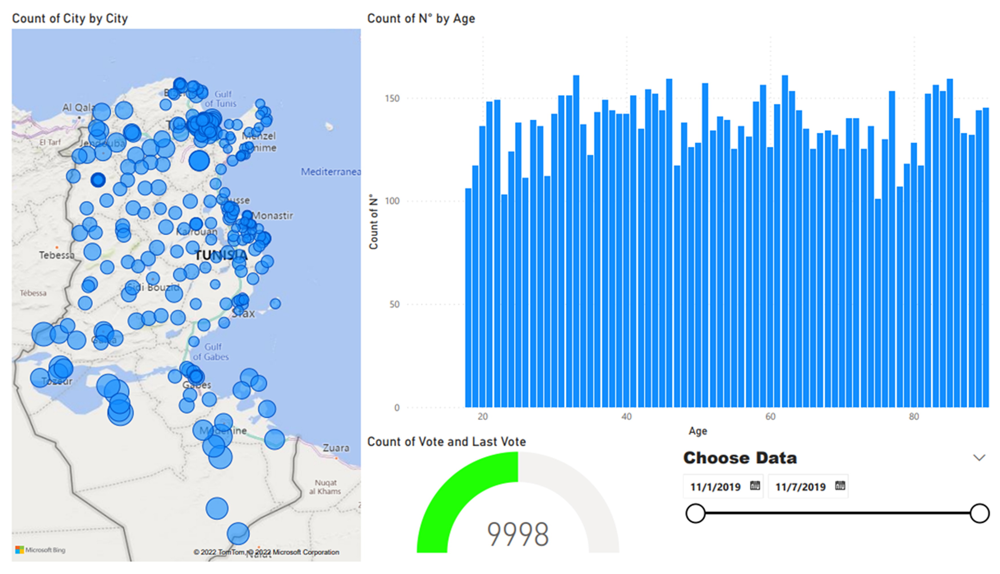
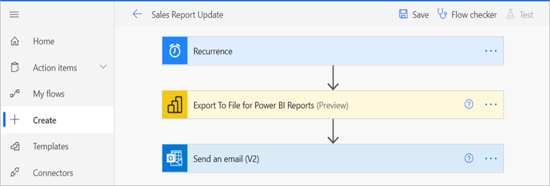
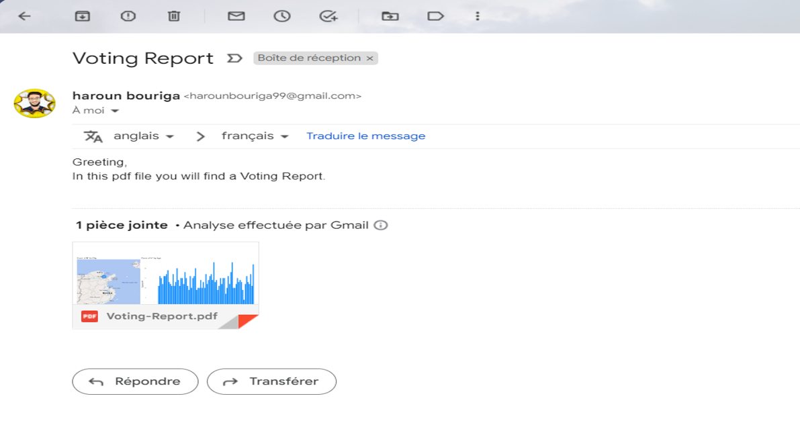

# Voting-Online

## First Step we decided to create a dataset to know what we can extract from this huge data and how to mange use it


- Put **number** of Voter you need (if you don't choose number it will be 100,000 by default)
- **optionally**:rose: Choose specific name for Excel file(if you don't do it the file name automatically will be Simulation)
  **Finally, you have an Excel file containing all of these details** :boom::smiley:

|     | Variable    | Explanation                            |
| --: | :---------- | :------------------------------------- |
|   0 | Id          | Number uniquely assigned to each voter |
|   1 | Opinion     | Opinion Yes or No                      |
|   2 | Age         | Voter Age                              |
|   3 | DateByY_M_D | Date of Vote : Year-Month-Day          |
|   4 | Hour        | The Houre when vote is send            |
|   5 | City        | The city of the voter                  |

---

<h2>Please Click on the button below  </h1>

**See how we manipulating and creating data**

:point_down:

[](https://mybinder.org/v2/gh/HarounTheGreat/Voting-System/main?filepath=index.ipynb)

## Data visualization :loop: using Power Bi :two: :

[Click here](https://drive.google.com/drive/folders/1lzlbsA1hEccba5gHoPWEhuBA5Et1lC-U?usp=share_link)




Automate Power to Send PDF Report every hour :clock10:





we develop a voting platform using  

Open Django file and use this command to see it


```python
pyhton manage.py runserver
```

<!--  -->


**conclusion**
Analysing Data Produced by Voters can help us to discover mony information to see what people want.

What about the vast amounts of data on social media? This link will take you to my GitHub Repositories if you want to learn more about opening mining and how to extract and analyze comments on social media.

:point_down:

[click here](https://github.com/HarounTheGreat/Data-Analytics)


[click here](https://github.com/HarounTheGreat/Voting-System/blob/9bc0fe0d6dfea8e1a61eae138fd7f95f5bb69d5d/encrypts/index.ipynb)